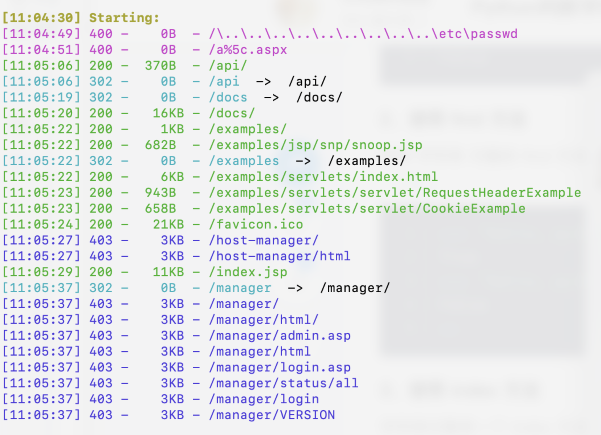
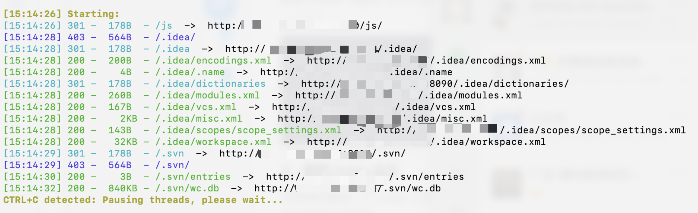

dirsearch - Web path discovery
=========

原文见： https://github.com/maurosoria/dirsearch  
  
基于 dirsearch v0.4.2 版本修改

修改内容：  
1. 主要修改了 200 这类状态码只有路径，导致复制粘贴不太方便，所以新增了全链接来使用；
2. 对帮助信息进行了翻译，更佳适合国人使用，怕自己翻译对不准确，所以保留了原英文。  

下图为修改前的截图：  

下面为修改后的截图：  
  

下面为翻译后的帮助信息截图：  

## 别犹豫了呀，简直就是 Ctrl + C/V 工程师的福音啊！！
